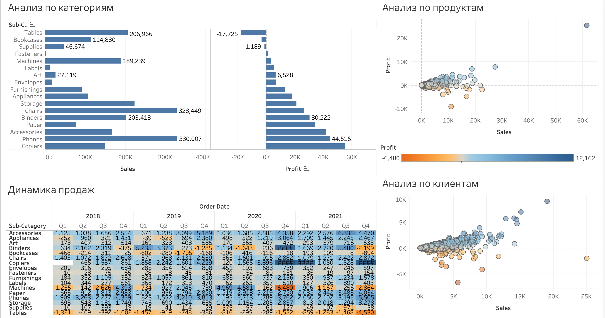

# Дашборд покупок (Tableau)


Интерактивный дашборд Tableau, который показывает полный цикл розничных продаж за 2018–2021 годы. Исследуйте продажи, прибыль и поведение клиентов по категориям товаров, отдельным продуктам и покупателям.

## Возможности

- **Многоуровневый анализ:** категория → продукт → клиент
- **Динамические фильтры:** год, квартал, категория, сегмент
- **Тепловая карта динамики продаж:** быстрый поиск сезонных пиков и спадов
- **Цветовая кодировка прибыльности:** расходящаяся палитра для мгновенного инсайта
- **Адаптивный макет:** удобно на десктопе и планшете

## Структура репозитория

```text
purchase-dashboard/
├── purchase_overview.twb
├── superstore_data.xls
└── images/
    ├── overview.png
    ├── categories.png
    ├── customers.png
    ├── products.png
    └── sales_dynamics.png
```

## Быстрый старт

1. Клонируйте репозиторий
   ```bash
   git clone https://github.com/<username>/<repo>.git
   cd <repo>
   ```
2. Откройте `purchase_overview.twb` в Tableau Desktop версии 2023.1 или новее.
3. При первом открытии укажите источник данных `superstore_data.xls`, лежащий в корне проекта.
4. Наслаждайтесь анализом! 🎉

## Скриншот



